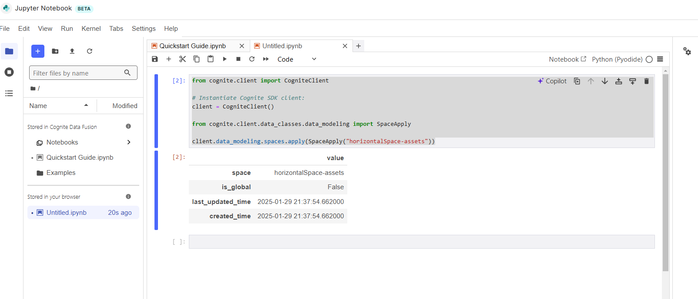
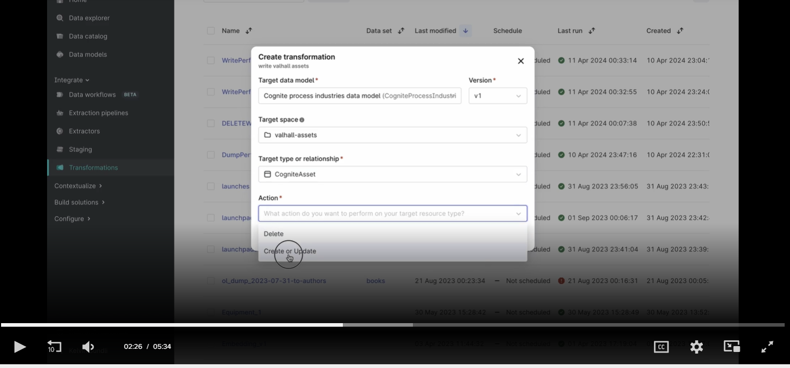
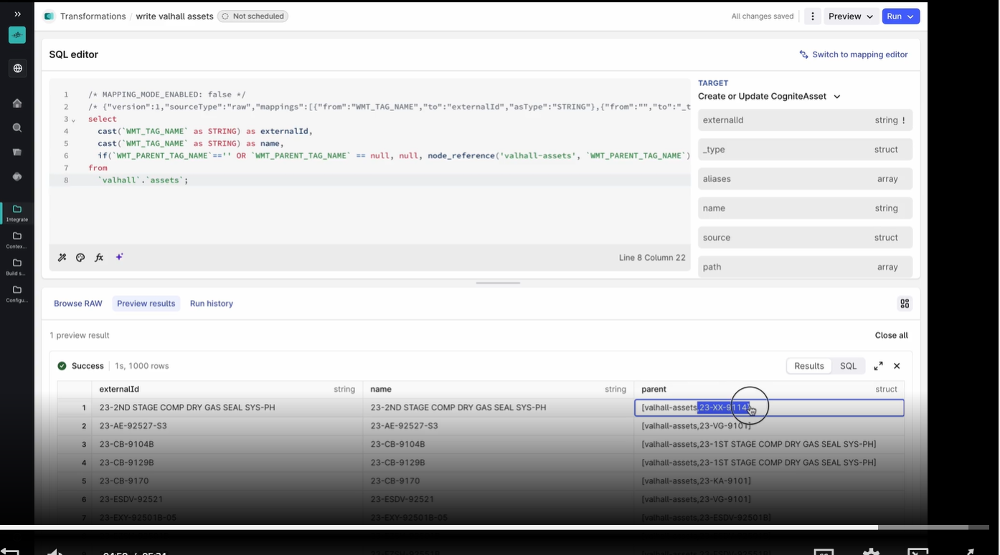

# cognite-datamodeling
## Transform data into asset hierarchy in Cognite process industries data model

This is a simple step by step to get data from stage, ex: assets data and bring it to a cognite core data model (ex: cdf_idm)

Get the data that is in stage area, the first step is to create a Space, we can do it using jupyter notebook

```
from cognite.client import CogniteClient

# Instantiate Cognite SDK client:
client = CogniteClient()

from cognite.client.data_classes.data_modeling import SpaceApply

client.data_modeling.spaces.apply(SpaceApply("horizontalSpace-assets"))
```



Then we can create a transformation to add the assets in the Cognite Industries Data Model (cdf_idm)



The node reference fucntion is used to set the relanshiop with the parent asset 



## Upload a file to core data model and link to an asset

Upload a P&D file into Cognite

- the first step is to create a space where the files lives.
- the upload the file metadata and create a direct relashionship with the asset we want to link
- then we upload the file content


